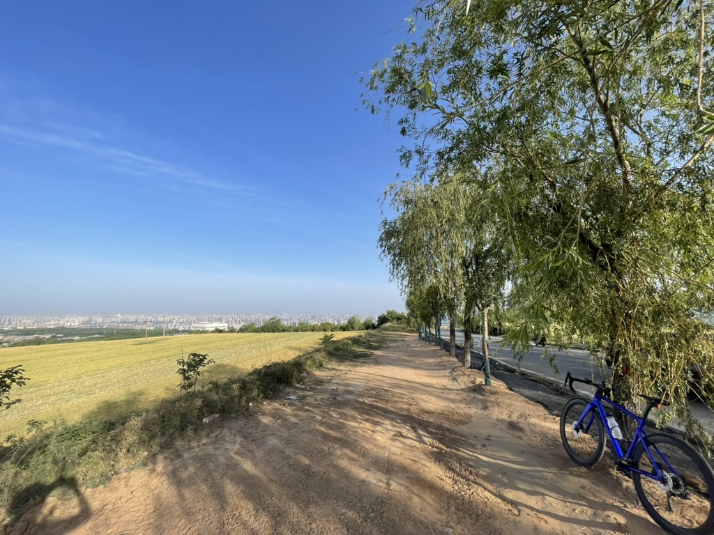

<picture>
  <source media="(prefers-color-scheme: dark)" srcset="https://raw.githubusercontent.com/hjnnjh/hjnnjh/output/github-contribution-grid-snake-dark.svg" />
  <source media="(prefers-color-scheme: light)" srcset="https://raw.githubusercontent.com/hjnnjh/hjnnjh/output/github-contribution-grid-snake.svg" />
  
</picture>

# Hi there 👋 I'm hjnnjh

I’m a PhD student specializing in user behavior analysis, deep learning, and deep generative models.  

🔭 Currently working on: research projects in user behavior modeling and generative model development  
🌱 Currently learning: advanced representation learning, reinforcement learning, and probabilistic modeling  
💬 Ask me about: deep learning frameworks (PyTorch, JAX (JAX is really cool!)), VAEs, Neural TPPS, and user behavior analytics  
📫 How to reach me: feel free to connect on GitHub  
⚡ Fun fact: I enjoy hiking and playing the guitar in my free time  

🚴‍♂️ Hobbies: road cycling, badminton, PC hardware, and exploring cutting-edge technology; recently enjoying playing with LLM's MCP.  

Follow me on [Strava](https://strava.app.link/o1qJHdlBkTb) as well!

